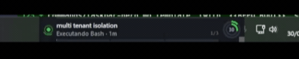

> 🇧🇷 [Leia em português](README.md)

# Task Bar Hero Code

[](LICENSE)




A tiny floating widget that stays **always on top of everything** on your
Windows desktop, showing in real time what each
[Claude Code](https://claude.com/claude-code) session is doing — animated
state pulse, terminal name, active subagents, context usage and 5h rate
limit. It runs directly on your machine (no browser extension, no external
service) and is **fully free-form**: drag it anywhere on screen and resize
it however you like — it remembers both position and size the next time it
opens.

## What it shows

- **Pulse indicator** (dot on the left): pulsing green = working, yellow =
  waiting for your response, hollow gray = idle.
- **Terminal name**: prioritizes the name you gave the Warp tab (read
  directly from `warp.sqlite`), then the conversation title generated by
  Claude Code, then a derived name, then the folder.
- **Status + elapsed time**: e.g. "Running Bash · 12s".
- **Robot icon**: appears when a subagent is running in that session; shows
  the agent type and description, or completion stats (tool uses / tokens /
  time). With multiple concurrent agents, shows a counter.
- **Double usage ring**: inner ring = % of conversation context (per
  session), outer ring = % of the 5h rate limit (account-wide — always the
  most recent value across all sessions). Same colors/thresholds as
  `/statusline` (green <50%, yellow <70%, red above that).
- **"Stories" bar** at the bottom, Instagram-style, showing how many
  terminals exist and when it's about to switch to the next one.

## How it works

```
Claude Code hooks (PreToolUse/PostToolUse/Notification/Stop/...)
        │  stdin JSON
        ▼
hooks/taskbar-hero-update.js  ──►  ~/.claude/taskbar-hero/status.json
                                     (per sessionId: cwd, tool, summary,
                                      agents{}, warpUuid)

statusline-command.js (user's existing one, with a small addition)
        ▼
~/.claude/taskbar-hero/usage.json   (per sessionId: contextPct, sessionPct)

~/.claude/sessions/<pid>.json       (already provided by Claude Code: status
                                      busy/idle, cwd, name)

warp.sqlite (Warp's own database)   (real tab name, matched via
                                      WARP_TERMINAL_SESSION_UUID)
        │
        ▼
ticker.pyw  ──►  tkinter window, polling every 1s (data) / 4s (Warp) /
                 60ms (re-asserts topmost), drawn entirely on a plain Canvas.
```

No build step, no external dependencies — just Python 3's stdlib (`ctypes`,
`sqlite3`, `tkinter`, `json`, `glob`, `os`, `time`, `math`, `pathlib`) and
Node's (`fs`, `path`, `os`). No `pip install`/`npm install` required.

## Installation

**Requirements**: Windows 10/11, Python 3.x with Tkinter, Node.js.

```powershell
powershell -ExecutionPolicy Bypass -File install.ps1
```

This auto-detects Python/Node, merges the hooks into your
`~/.claude/settings.json` (without deleting hooks you already had), offers to
apply the `/statusline` patch if you have a custom one, creates the autostart
shortcut, and starts the widget right away. Running it again doesn't
duplicate anything (idempotent). To uninstall:

```powershell
powershell -ExecutionPolicy Bypass -File uninstall.ps1
```

If you're an agent (Claude Code) installing this on someone's behalf, or the
script doesn't work in your environment, see **`INSTALL.md`** — it documents
the exact contract behind the script (the `settings.json` merge format, where
everything needs to exist, a verification checklist) so you can reproduce it
manually.

### Install as a Claude Code plugin

A lighter alternative to the installer above — no Start menu/Desktop/autostart
shortcuts, just the hook and the `/taskbar-hero` command available on demand:

```
/plugin marketplace add leonardosilvamelosantos/taskbar-code
/plugin install taskbar-code@taskbar-code
```

Then run `/taskbar-code:taskbar-hero` in any session to start the widget.

See `CHANGELOG.md` for version history.

## Known limitations

- The Start menu and Windows Action Center run in a shell layer that always
  stays above any regular "always on top" window, by Windows security
  design — no app (not even established tools like Rainmeter) can reliably
  overlap that without code signing + a UIAccess manifest.
- `warp.sqlite` is an internal, undocumented Warp schema with no stability
  guarantee — the code already degrades gracefully (falls back to the
  derived name) if the schema changes or Warp isn't running.

## Context menu (right-click on the widget)

- Pause/resume the carousel
- Reset position (re-anchors automatically near the taskbar)
- Quit

**Reopening it**: after closing, the installer leaves three ways to start it
again — search "Task Bar Hero Code" in the Start menu, the desktop shortcut,
or the `/taskbar-hero` command in any Claude Code session. Trying to open a
second instance while one is already running just brings up a "already
running" notice instead of duplicating the widget.

## Contributing

Contributions are welcome via fork + Pull Request. See `CONTRIBUTING.md` for
the full guide (encoding conventions, how to test installer changes, etc.).

## License

[MIT](LICENSE)
